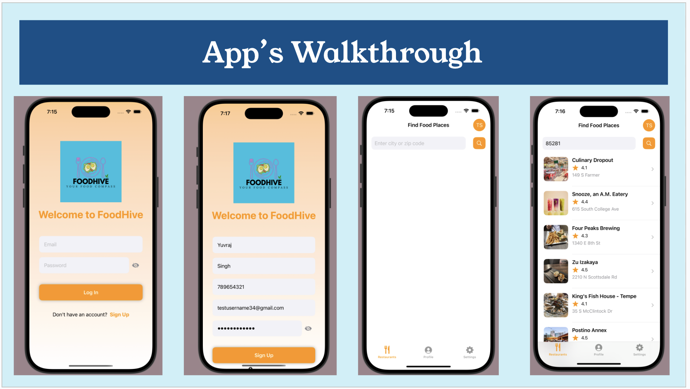

# FoodHive 🍽️  
**Your Food Compass to Discover and Navigate the Best Restaurants**  

---

## 🚀 Overview  
FoodHive is a feature-rich iOS application designed to make restaurant discovery intuitive and efficient. Whether you're exploring a new city or looking for local dining options, FoodHive offers:  
- Dynamic restaurant search.  
- Comprehensive details about each restaurant.  
- Seamless navigation using built-in maps.  

Built with **Swift** and the **MVVM architecture**, FoodHive integrates **Yelp API** for real-time data and **MapKit** for navigation, ensuring an exceptional user experience.  

---

## 🌟 Features  

### 🔍 Dynamic Restaurant Search  
- Effortlessly search for restaurants by city or zip code.  
- Displays real-time data, including:  
  - Names, ratings, and reviews.  
  - Addresses and thumbnail images for better clarity.  

### 📝 Interactive Restaurant Details  
- View comprehensive details about restaurants:  
  - Ratings and reviews.  
  - Locations with interactive maps.  

### 🗺️ Map Integration  
- Built-in navigation using **MapKit**.  
- Real-time geolocation updates for accurate directions.  

### 🎨 Clean User Interface  
- Designed following **Apple Human Interface Guidelines** for a seamless and responsive experience.  
- Supports accessibility features, ensuring usability for everyone.  

---

## Screenshots

### App Walkthrough

### Detailed Functionality

## 🛠️ Technology Stack  
| **Component**    | **Details**           |  
|-------------------|-----------------------|  
| **Language**      | Swift                |  
| **Architecture**  | MVVM                 |  
| **APIs Used**     | Yelp API, MapKit     |  

---

## 📋 Installation Guide  

### Prerequisites  
- **Xcode 14.0** or later.  
- **macOS 12.0 Monterey** or later.  

### Steps  
1. Clone this repository:  
   
bash  
   git clone https://github.com/tushmisharma17/CSE335FoodHive.git  
